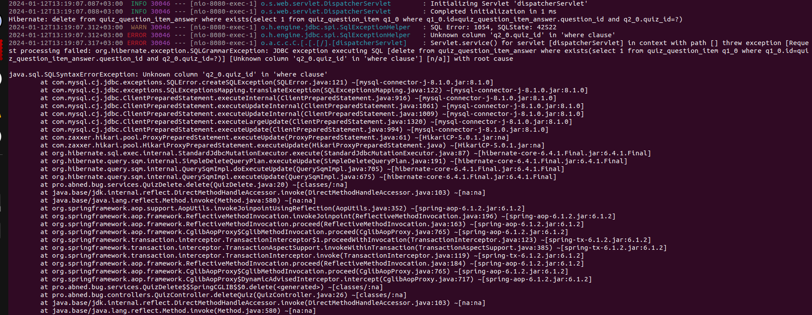

# HOW TO REPRODUCE THE BUG
Run the command below in project root directory:
```shell
./mvnw spring-boot:run
```
And excute these two urls:
- POST http://localhost:8080/api/v1/quizs (to create test data)
- DELETE http://localhost:8080/api/v1/quizs/{quiz_created_id} to try delete a quiz

You should have an exception like this: 